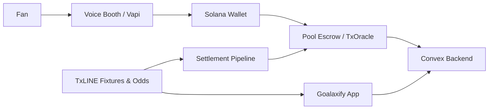

# Goalaxify

**Talk your bet.**

Goalaxify is a voice-native prediction experience for the 2026 World Cup — fans speak their picks, stake on-chain, and follow live goal moments with settlement backed by TxODDS oracle data.

**Live demo:** [goalaxify.vercel.app](https://goalaxify.vercel.app)

Built for the **TxODDS World Cup Hackathon** (Superteam Earn — Track 1: Prediction Markets & Settlement).

---

## Overview

Goalaxify combines a stadium-style voice booth, real-time World Cup fixtures from TxLINE, and Solana settlement into a single mobile-first app. Users connect a wallet, open the Prediction Booth, and place bets by conversation — no forms, no friction. Winnings are verified on-chain and tracked in a shared leaderboard.



---

## Features

### Voice prediction booth

- **Talk your bet** — a Vapi-powered stadium announcer walks users through outcome selection (`home` / `draw` / `away`) and stake amount, confirms verbally, then executes the bet.
- **Wallet-linked sessions** — every voice call is tied to the connected Solana wallet for identity and settlement proof.
- **Client-side tool execution** — prediction submit, cancel, and end-call tools run in the browser; the wallet signs transactions locally.
- **Manage by voice** — open bets can be updated from the booth: **cancel** for a full refund or **replace** to change pick/stake before kickoff (one manage action per bet).
- **Krisp-safe audio** — Daily noise-cancellation is patched for reliable mic access across browsers.

### Multilingual app and voice

Goalaxify ships with **10 languages** for both UI and voice:

| Code | Language |
|------|----------|
| `en` | English |
| `es` | Español |
| `fr` | Français |
| `pt` | Português |
| `de` | Deutsch |
| `it` | Italiano |
| `zh` | 中文 |
| `ja` | 日本語 |
| `ko` | 한국어 |
| `ar` | العربية |

- **Unified language setting** — one picker in Settings drives the entire app and the voice booth.
- **Localized announcer** — system prompt, opening line, and Deepgram transcription model adapt to the selected language.
- **Full UI coverage** — navigation, home, booth, live, profiles, leaderboard, wallet, and settings are translated.

### On-chain staking and settlement

- **Dual stake paths**
  - **SOL** — native transfers to a pool escrow authority.
  - **USDC** — TxODDS `txoracle` intent with hashed terms on Solana devnet.
- **Parimutuel-style payouts** — estimated returns shown at stake time; winners claim after oracle-backed resolution.
- **Bet lifecycle** — `open` → `locked` (kickoff) → `won` / `lost` → `settled` after claim, or `cancelled` / `replaced` when managed pre-match.
- **Cancel & replace** — refund via settlement API, balance wait, then optional re-stake with `supersedesPredictionId` linkage in Convex.
- **Automated resolution** — cron-triggered resolve endpoint matches TxLINE results to open predictions.

### Live World Cup data (TxLINE)

- Official **TxODDS TxLINE SDK** integration — guest JWT, World Cup tier subscription, fixture/odds/score feeds.
- **Real fixtures only** — upcoming matches, odds, and kickoff times from TxLINE; no hardcoded match cards in production.
- **Live moments** — goal, halftime, and full-time events on the Live tab for the current World Cup match.
- **Kickoff enrichment** — Convex fixtures plus `/api/fixtures/kickoffs` for accurate schedule display and bet lock timing.

### Progressive Web App (PWA)

- **Installable** — add Goalaxify to your home screen on mobile or desktop.
- **Standalone display** — full-screen, app-like experience without the browser chrome.
- **Service worker** — caches the app shell and static assets; offline fallback when the network drops.
- **App shortcuts** — quick launch to Booth, Live, and Leaderboard from the installed icon.
- **Install prompt** — native “Add to Home Screen” banner when the browser supports it.

### Profiles, bets, and leaderboard

- **Profiles** — display name, avatar upload (Cloudinary), wallet tab, and full bet history.
- **Bet cards** — status, stake, estimated return, claim winnings, and “Manage by voice” deep links.
- **Leaderboard** — top winners ranked by total SOL won, plus a recent wins feed.
- **Wallet gate** — booth and sensitive flows require a connected Phantom or Solflare wallet.

### Settings and support

- Language picker, privacy policy, terms of service, and in-app support FAQ.
- Mobile-first layout with bottom navigation and safe-area padding for notched devices.

---

## Tech stack

| Layer | Technology |
|-------|------------|
| Frontend | Next.js 16, React 19, TypeScript, Tailwind CSS 4 |
| Voice | Vapi Web SDK, Deepgram transcription |
| Blockchain | Solana (web3.js, Anchor), TxODDS `txoracle` program |
| Backend | Convex (predictions, profiles, fixtures, moments, leaderboard) |
| Data | TxODDS TxLINE (`@goalaxify/txline-sdk`) |
| Media | Cloudinary (avatars) |
| Wallets | `@solana/wallet-adapter` (Phantom, Solflare) |

---

## Monorepo structure

```
goalaxify/
├── apps/web/                 # Next.js app (UI, API routes, PWA)
├── convex/                   # Convex schema, mutations, queries
├── packages/
│   ├── txline-sdk/           # TxLINE auth, subscription, client
│   ├── solana-settlement/    # Pool escrow, txoracle intents
│   ├── config/               # Network constants
│   └── domain/               # Shared types (PredictionDraft, etc.)
├── scripts/                  # Pool authority setup
└── vendor/tx-on-chain/       # Vendored TxODDS IDL
```

---

## Getting started

### Prerequisites

- Node.js 20+
- npm
- A funded Solana devnet wallet (for TxLINE setup)
- Convex account
- Vapi account (voice booth)
- Cloudinary account (optional, for avatars)

### Install

```bash
git clone git@github.com:numdinkushi/goalaxify.git
cd goalaxify
npm install
cp .env.example .env
```

### Configure services

**1. TxLINE (World Cup fixtures & odds)**

Add your devnet wallet secret to `.env`, then run:

```bash
npm run txline:setup
```

This starts a guest session, subscribes to the free World Cup tier on devnet, activates your API token, and verifies fixture access. The script writes `TXLINE_GUEST_JWT`, `TXLINE_API_TOKEN`, and `TXLINE_SUBSCRIPTION_TX_SIG` to `.env`.

**2. Pool authority (SOL staking & payouts)**

```bash
npm run pool:setup
```

**3. Convex**

```bash
npm run convex:dev
```

Copy the deployment URL into `.env` as `NEXT_PUBLIC_CONVEX_URL`. Seed demo fixtures if needed:

```bash
npm run convex:seed
```

**4. Vapi (voice booth)**

Set `NEXT_PUBLIC_VAPI_ENABLED=true` and add your web token, API key, and booth assistant ID. See `.env.example` for the full list.

**5. Run the app**

```bash
npm run dev
```

Open [http://localhost:3000](http://localhost:3000).

---

## Environment variables

See [`.env.example`](.env.example) for the full template. Key groups:

| Group | Purpose |
|-------|---------|
| **Convex** | `CONVEX_DEPLOYMENT`, `NEXT_PUBLIC_CONVEX_URL`, `CONVEX_DEPLOY_KEY` |
| **Vapi** | `NEXT_PUBLIC_VAPI_WEBTOKEN`, `VAPI_API_KEY`, `NEXT_PUBLIC_VAPI_BOOTH_ASSISTANT_ID` |
| **TxLINE** | `TXLINE_GUEST_JWT`, `TXLINE_API_TOKEN`, `TXLINE_SUBSCRIPTION_TX_SIG` |
| **Solana** | `NEXT_PUBLIC_SOLANA_NETWORK`, `NEXT_PUBLIC_SOLANA_RPC_URL`, `NEXT_PUBLIC_SOLANA_PROGRAM_ID` |
| **Settlement** | `POOL_AUTHORITY_PUBKEY`, `POOL_AUTHORITY_SECRET`, `SETTLEMENT_CRON_SECRET` |
| **Cloudinary** | `CLOUDINARY_CLOUD_NAME`, `CLOUDINARY_API_KEY`, `CLOUDINARY_API_SECRET` |

Never commit secrets. Server-only keys (`POOL_AUTHORITY_SECRET`, `VAPI_API_KEY`, `SETTLEMENT_CRON_SECRET`) must stay off the client.

---

## Scripts

| Command | Description |
|---------|-------------|
| `npm run dev` | Start the Next.js dev server |
| `npm run build` | Production build (all workspaces) |
| `npm run typecheck` | Typecheck all packages |
| `npm run lint` | Lint all workspaces |
| `npm run convex:dev` | Start Convex dev deployment |
| `npm run convex:seed` | Seed fixtures and moments |
| `npm run txline:setup` | TxLINE World Cup tier setup |
| `npm run pool:setup` | Generate pool authority keypair |

Inside `apps/web`:

| Command | Description |
|---------|-------------|
| `npm run build:pwa` | Build and copy manifest + service worker to `.next/static/` |

---

## Deployment

| Target | Path / notes |
|--------|----------------|
| **Vercel** | Deploy `apps/web`; set all env vars in the project dashboard |
| **Convex Cloud** | Deploy from `/convex` via `npx convex deploy` |
| **Solana** | TxODDS `txoracle` on devnet (`6pW64gN1s2uqjHkn1unFeEjAwJkPGHoppGvS715wyP2J`) |

For PWA install prompts, the app must be served over **HTTPS** (Vercel provides this automatically).

---

## App routes

| Route | Description |
|-------|-------------|
| `/` | Home — hero, upcoming matches, quick actions |
| `/booth` | Voice prediction booth |
| `/live` | Live goal moments |
| `/profiles` | Profile, wallet, and bet history |
| `/leaderboard` | Rankings and recent wins |
| `/settings` | Language, legal, support |
| `/wallet` | Redirects to profile wallet tab |

---

## API routes

| Route | Method | Purpose |
|-------|--------|---------|
| `/api/fixtures/kickoffs` | GET | Kickoff time enrichment |
| `/api/settlement/cancel` | POST | Refund open bet |
| `/api/settlement/claim` | POST | Claim winnings |
| `/api/settlement/resolve` | POST | Resolve fixture (cron) |
| `/api/vapi/webhook` | POST | Vapi call lifecycle events |
| `/api/profile/avatar` | POST | Avatar upload |

---

## Hackathon alignment

Goalaxify is designed for **Track 1: Prediction Markets & Settlement** on Superteam Earn:

- **Voice-native UX** — lowers the barrier to placing a prediction during live match excitement.
- **TxLINE oracle data** — fixtures, odds, and results from TxODDS, not mock feeds.
- **On-chain settlement** — SOL pool escrow and USDC txoracle intents with verifiable transaction signatures.
- **Global reach** — 10-language UI and voice for World Cup audiences worldwide.
- **PWA** — installable on any device without an app store.

---

## License

MIT

---

## Author

**numdinkushi** — [GitHub](https://github.com/numdinkushi)

Built with focus on fan experience, oracle integrity, and on-chain proof.
